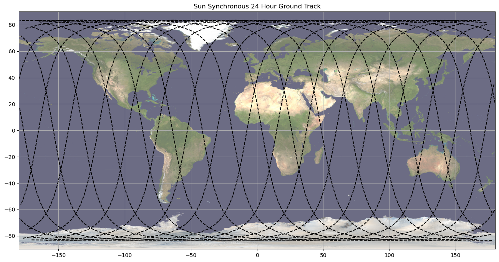

# PlotGroundtracks
Example for plotting groundtracks of satellites around a spherical Earth.

# Dependencies
Numpy  
Matplotlib  
SpiceyPy  
SciPy - For generating an example orbit in Example.ipynb  
NAIF Kernels:  
naif0012.tls https://naif.jpl.nasa.gov/pub/naif/generic_kernels/lsk/  
pck00011.tpc https://naif.jpl.nasa.gov/pub/naif/generic_kernels/pck/  

